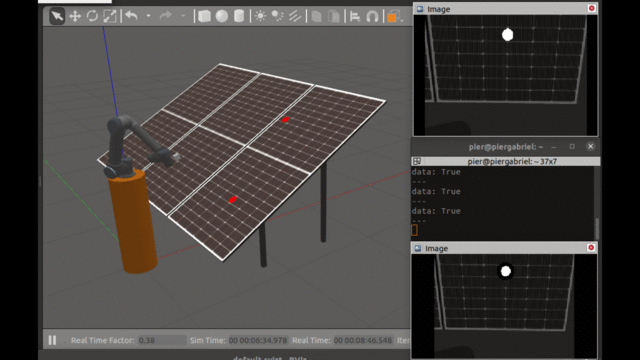

# ur5_sim_control_teleop

This package provides a framework to simulation, teleoperation and control of arm robotic UR5.

    

## Installation

In this section, you will find the installation instructions for making it work. The next section (prerequisites) tells you the environment in which the package has been tested.

### Prerrequisites and dependencies

This package has been designed and tested in an x86_64 machine under a Ubuntu 20.04 operating system and ROS Noetic distribution. Besides, the scripts provided lets you easily install the following dependencies:

- hector_gazebo (https://github.com/tu-darmstadt-ros-pkg/hector_gazebo)
- flip_image
- yaml-cpp
- timed_roslaunch
- universal_robot (https://github.com/ros-industrial/universal_robot)
- upo_actions (https://github.com/robotics-upo/upo_actions, branch: master)
- fireawareness_ros (Private repository, provided by: robotics-upo)

